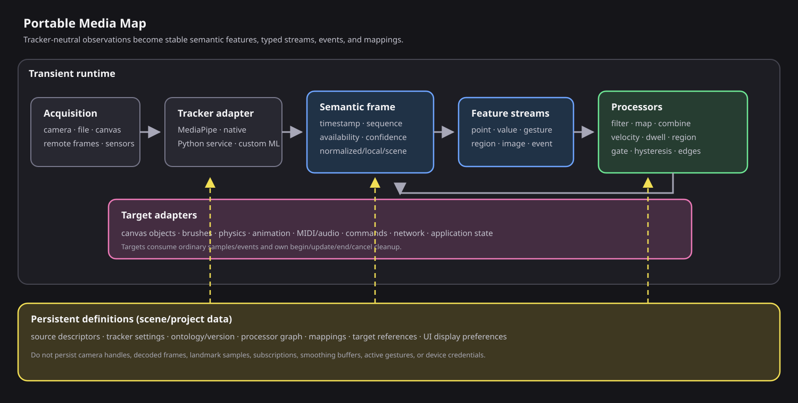
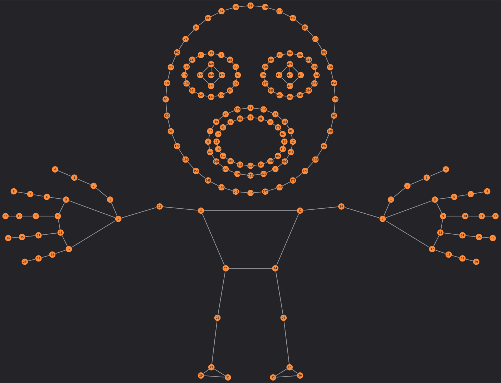

# Portable Media Map architecture

> A language- and tracker-independent specification for reproducing Underscore's Media Map philosophy, interaction model, stream processing, event authoring, and system mappings.



This document describes the contract to preserve when porting the system. MediaPipe Holistic is the current landmark producer, but it is not the architecture. A JavaScript browser model, a Python service, a native vision framework, recorded data, or a non-vision sensor can all implement the same adapter and expose the same user-facing model.

The goal is not merely to draw a skeleton. The goal is to turn changing observations into named, inspectable, reusable signals that can drive graphics, physics, sound, code, and application behavior without coupling those systems to a particular tracker.

## 1. Design goals

The implementation should make these tasks easy:

1. Add or reconnect an input source without rebuilding every downstream mapping.
2. Replace the tracking backend while keeping semantic feature identifiers stable.
3. Inspect the current value, confidence, age, and coordinate spaces of a feature.
4. Convert continuous observations into filtered values, held state, and lifecycle events.
5. Map a feature or event to an object, brush, physical system, sound engine, command, or external endpoint.
6. Keep authoring UI, live rendering, scripts, snapshots, and mappings semantically consistent.
7. Save configuration without serializing high-rate frames or browser/device handles.
8. Degrade safely when a source, landmark, permission, or target is unavailable.

## 2. Core philosophy

### 2.1 The tracker is an adapter

A tracker produces backend-specific observations. An adapter translates those observations into a canonical semantic frame. No target should depend directly on a MediaPipe result, native SDK object, tensor, socket packet, or camera element.

```text
backend observation -> tracker adapter -> semantic frame -> feature streams
```

Only the adapter knows backend indices, field names, model versions, and transport details.

### 2.2 Stable semantics are more valuable than stable indices

Consumers request `left_hand.index_finger_tip`, not `landmarks[8]`. The ontology owns the relationship between the stable identifier and the current backend representation. Compatibility aliases may exist, but saved mappings should use canonical identifiers.

### 2.3 Persistent intent, transient observation

Persist what the author intended:

- sources and tracker settings;
- ontology and schema versions;
- selected display groups;
- named processors, mappings, targets, and offsets;
- UI preferences that affect authored output.

Keep these runtime-only:

- camera/file handles and credentials;
- decoded image surfaces and model objects;
- current landmark frames and image samples;
- subscriptions, smoothing buffers, traces, active gates, and open strokes;
- device connection and permission state.

After reload, a definition may be valid but unresolved. The UI should say `waiting`, `permission required`, or `source unavailable`; it should not silently delete the definition.

### 2.4 Missing is not zero

Every feature reports availability. A missing wrist must not become `(0, 0)`, because zero may be a valid coordinate and could move an object or trigger an event. Consumers either reject an unavailable sample or use an explicit grace policy.

### 2.5 Coordinate spaces are part of the type

The same point can be expressed in normalized source coordinates, local processor coordinates, or scene/world coordinates. A consumer chooses a space explicitly. Coordinate conversion is centralized and tested rather than repeated inside each mapping.

### 2.6 Rendering is a view of the data

The live overlay, visual picker, native snapshot, script service, and mappings consume the same ontology and feature filters. If the user disables a face category or swaps semantic handedness, all affected views should agree.

### 2.7 Inference cadence and display cadence are separate

Tracking may run at a protected ceiling while the overlay interpolates between completed frames. Interpolation can improve appearance, but semantic frames, events, mappings, scripts, and snapshots must use completed tracker results. Visual interpolation must never invent semantic events.

### 2.8 Events have lifecycles

Interaction is not just a stream of booleans. Gates and gestures need hysteresis, debounce, missing-signal grace, and clear `begin/update/end/cancel` semantics. Targets need deterministic cleanup when a source disappears or the runtime stops.

## 3. Reference architecture

The system has seven separable layers:

| Layer | Responsibility | Examples |
| --- | --- | --- |
| Acquisition | Produces images or raw observations | camera, video, canvas, network frame, sensor |
| Tracker adapter | Converts backend results to the canonical observation model | MediaPipe, Vision framework, Python service |
| Ontology | Names points, aggregates, topology, categories, and derived gestures | pose, hands, face, pinch, palm |
| Semantic frame | Immutable snapshot of features at one tracker time | availability, confidence, spaces, values |
| Stream registry | Publishes typed current samples and subscriptions | space, value, event, time, image |
| Processor graph | Filters and derives values, state, and events | smooth, map, velocity, region, gate, edge |
| Mapping/targets | Applies results to other systems | object position, brush, physics, MIDI, command |

Each layer can be tested independently. A recorded semantic-frame fixture should be enough to test every layer after the tracker adapter.

## 4. User-facing model

### 4.1 Sources

A source is a stable, named input definition. It may be panel-only or have an optional canvas view. Hiding or deleting the optional view must not stop the upstream source unless the user explicitly disables the source.

Recommended source status values:

- `disabled`
- `waiting`
- `permission-required`
- `connecting`
- `ready`
- `paused`
- `stale`
- `error`

The source panel should expose source-specific configuration, transport where applicable, output size/crop/mirror, and a small live preview.

### 4.2 Trackers/processors

A tracker chooses a source and publishes one semantic stream. It exposes processing cadence, model/adapter choice, detection and tracking thresholds, semantic handedness, and display options.

The tracker rectangle or canvas host is both:

- a view bounds for the optional overlay; and
- the transform from normalized coordinates into scene space.

Moving, scaling, or rotating the host changes scene-space features without changing normalized observations.

### 4.3 Feature browser and visual picker

The Mapping UI should provide two synchronized selectors:

- a searchable semantic feature list; and
- a visual body/hand/face map.

Selecting a feature in either place should:

- highlight it in the other selector;
- show its live availability, confidence, age, and value;
- show all supported coordinate spaces;
- highlight it on the canvas overlay;
- optionally append a bounded trace;
- make it available to a new mapping or processor.

An illustrative semantic body map is included below. It is a UI aid, not the source of ontology truth.



### 4.4 Inputs and processors

Once exposed as a typed stream, a tracking feature should behave like pointer, MIDI, clock, serial, WebSocket, or virtual data. The Inputs panel edits durable source and processor definitions. It should display input and output kinds before the user connects them.

### 4.5 Mapping/actors

The Mapping panel is the high-level authoring surface:

- choose a tracker stream;
- choose and inspect a feature;
- create, duplicate, enable, test, or remove a binding;
- choose a target and target anchor;
- add offset, smoothing, confidence, grace, and gate settings;
- toggle highlight and trace diagnostics.

Mappings are dormant, not destructive, when their source or target is unavailable.

## 5. Canonical data contracts

The following structures are illustrative. They may be structs, records, classes, protocol messages, or database rows. Preserve their meaning rather than their exact JSON spelling.

### 5.1 Source descriptor

```json
{
  "version": 1,
  "id": "source.camera.front",
  "name": "Front camera",
  "kind": "camera",
  "enabled": true,
  "settings": {
    "device": "user-facing",
    "crop": { "x": 0, "y": 0, "width": 1, "height": 1 },
    "mirrorPixels": true,
    "outputMaxDimension": 640
  }
}
```

The saved descriptor should not contain an active camera handle.

### 5.2 Tracker descriptor

```json
{
  "version": 1,
  "id": "tracker.performer",
  "name": "Performer",
  "adapter": "holistic-v1",
  "sourceId": "source.camera.front",
  "enabled": true,
  "processingFps": 8,
  "semanticHandednessSwap": true,
  "thresholds": { "detection": 0.5, "tracking": 0.5 },
  "display": {
    "showSource": false,
    "points": true,
    "connections": true,
    "groups": ["pose.body", "left_hand", "right_hand", "face.outline"]
  }
}
```

`semanticHandednessSwap` remaps left/right meaning. It is independent from mirroring source pixels.

### 5.3 Semantic frame envelope

```json
{
  "schemaVersion": 1,
  "streamId": "tracker.performer",
  "sequence": 1842,
  "capturedAt": 52301.4,
  "processedAt": 52318.9,
  "available": true,
  "adapter": { "id": "holistic-v1", "backendVersion": "opaque" },
  "features": {}
}
```

Use a monotonic clock for durations and ordering. If wall time is needed for interchange, carry it as an additional field rather than using it for smoothing or debounce.

### 5.4 Point feature

```json
{
  "id": "right_hand.index_finger_tip",
  "kind": "point",
  "family": "right_hand",
  "available": true,
  "confidence": 0.91,
  "updatedAt": 52318.9,
  "normalized": { "x": 0.63, "y": 0.38, "z": -0.04 },
  "local": { "x": 403.2, "y": 182.4, "z": -0.04 },
  "scene": { "x": 922.8, "y": 411.5, "z": -0.04 }
}
```

### 5.5 Scalar or gesture feature

```json
{
  "id": "right_hand.pinch",
  "kind": "gesture",
  "available": true,
  "confidence": 0.87,
  "value": 0.28,
  "active": true,
  "updatedAt": 52318.9
}
```

For a scale-independent pinch, divide thumb-to-index distance by a palm-size reference. Use separate close and open thresholds to prevent chatter.

### 5.6 Aggregate/region feature

```json
{
  "id": "right_hand.palm",
  "kind": "region",
  "available": true,
  "confidence": 0.86,
  "points": ["...feature snapshots..."],
  "centroid": { "x": 901.2, "y": 438.7, "z": -0.02 },
  "bounds": { "x": 870, "y": 402, "width": 74, "height": 82 },
  "closed": true
}
```

### 5.7 Typed stream descriptor and sample

```json
{
  "descriptor": {
    "id": "performer.right-index",
    "name": "Right index tip",
    "kind": "space",
    "capabilities": ["space"],
    "roles": ["input", "output"],
    "available": true
  },
  "sample": {
    "id": "sample-1842",
    "streamId": "performer.right-index",
    "kind": "space",
    "time": 52318.9,
    "available": true,
    "space": "scene",
    "position": { "x": 922.8, "y": 411.5, "z": -0.04 }
  }
}
```

Recommended primary stream kinds are `space`, `value`, `event`, `time`, and `image`. Capabilities and input/output roles may overlap; avoid separate incompatible input and output buses.

### 5.8 Binding/mapping definition

```json
{
  "version": 1,
  "id": "binding.right-index-object",
  "name": "Index drives cursor",
  "enabled": true,
  "source": {
    "streamId": "tracker.performer",
    "featureId": "right_hand.index_finger_tip",
    "space": "scene"
  },
  "filter": {
    "confidenceMin": 0.5,
    "smoothingMs": 40,
    "missingGraceMs": 120
  },
  "gate": {
    "featureId": "right_hand.pinch",
    "comparator": "active"
  },
  "transform": {
    "offset": { "x": 0, "y": 0 }
  },
  "target": {
    "kind": "object-position",
    "id": "object.cursor",
    "anchor": "center"
  },
  "diagnostics": { "highlight": true, "trace": false }
}
```

The portable mapping shape is:

```text
Source -> Filter -> Transform -> Target
```

Tracker features are one source adapter among many, not a special target-specific route format.

## 6. Ontology

The ontology is the single registry of semantic meaning. A feature definition should contain:

```json
{
  "id": "left_hand.index_finger_tip",
  "label": "Left index tip",
  "family": "left_hand",
  "kind": "point",
  "aliases": [],
  "backendBindings": {
    "mediapipe-holistic": { "list": "leftHandLandmarks", "index": 8 },
    "native-tracker-x": { "key": "hand.left.index.tip" }
  },
  "displayGroups": ["left_hand", "left_hand.index"],
  "connections": []
}
```

The portable core should not assume that every backend has the same feature count. An adapter reports which canonical features it can produce.

### 6.1 Recommended families

- `pose`
- `left_hand`
- `right_hand`
- `face`
- `body` for derived cross-family aggregates

### 6.2 Feature kinds

- `point`: one observed or derived position;
- `region`: a group with centroid/bounds and optional topology;
- `path`: ordered points, open or closed;
- `value`: scalar measurement;
- `gesture`: value plus held active state;
- `event`: discrete lifecycle transition;
- `image`: image-like observation when needed downstream.

### 6.3 Display categories and topology

Topology belongs in the ontology, not the renderer. Face categories may include outline, eyes, iris, nose, mouth, brows, and uncategorized remaining points. A category can be deliberately points-only. This prevents a renderer or snapshot path from inventing connections that the semantic filter did not request.

### 6.4 Aliases and migrations

Aliases are read compatibility. New writes use canonical IDs. Scene migrations should be deterministic and versioned. Unknown feature IDs remain visible as unresolved mappings so an author can repair them.

## 7. Coordinate model

### 7.1 Normalized space

Normalized coordinates describe the processed tracker input, usually with `x` and `y` in `[0, 1]`. They are downstream of authored crop and pixel mirroring. Record the convention for origin, axis directions, depth sign, and whether values may exceed the nominal range.

### 7.2 Local space

For a tracker host of width `W` and height `H`:

```text
local.x = normalized.x * W
local.y = normalized.y * H
```

Depth may remain normalized observation data unless the application defines a calibrated 3D projection.

### 7.3 Scene/world space

Rotate the local point around the host center, then translate it to the host position:

```text
dx = local.x - W/2
dy = local.y - H/2

scene.x = center.x + dx*cos(angle) - dy*sin(angle)
scene.y = center.y + dx*sin(angle) + dy*cos(angle)
```

If the destination system uses meters, device pixels, or another world basis, add a named calibrated space rather than overloading `scene`.

### 7.4 Pixel mirror versus semantic handedness

These are different operations:

- Pixel mirror changes the displayed/input image transform.
- Semantic handedness swap changes which observation is called `left_hand` or `right_hand`.

A mirrored selfie feed often needs both a visual mirror and an explicit semantic policy. Apply handedness consistently to overlay rendering, feature lookup, mappings, events, snapshots, and scripts.

## 8. Runtime and scheduling

### 8.1 Backpressure

Allow at most one inference in flight per tracker unless the backend explicitly supports ordered pipelining. When a result is pending, coalesce or skip newer frames rather than building an unbounded queue.

The configured processing rate is a ceiling, not a guarantee:

```text
actual cadence <= source cadence
actual cadence <= processing ceiling
actual cadence <= backend throughput
```

### 8.2 Completed semantic frames

Publish one immutable semantic frame per completed result. All features in the frame share its sequence and timestamp. Do not publish a half-updated body where some features belong to different tracker results.

### 8.3 Display interpolation

An optional display loop may interpolate point geometry from the previous completed result to the newest completed result. It must not:

- publish extra semantic frames;
- create gesture edges;
- alter snapshots or script values;
- affect mapping timestamps;
- claim improved tracker confidence.

### 8.4 Thread/process boundaries

A backend may run on the UI thread, a worker, a native thread, or a remote process. Across a boundary, transmit a compact semantic frame or backend observation plus timestamps. Preserve ordering and discard late results older than the current accepted sequence.

### 8.5 Clock rules

Use one monotonic time basis for frame age, smoothing, dwell, debounce, cooldown, and grace. If a remote producer has its own clock, carry both producer and receiver timestamps and estimate latency explicitly.

## 9. Signal processing

The stream graph should operate on ordinary typed samples. Useful processor families are:

### Geometry

- distance between two points;
- midpoint or weighted blend;
- delta/vector between points;
- region membership;
- path or curve crossing.

### Motion

- velocity and speed;
- acceleration;
- dwell within a radius or region;
- direction or angular change.

### Value

- range mapping and clamping;
- scale/offset/invert;
- combine two values;
- safe formulas or lookup tables.

### Filter

- exponential smoothing using elapsed time;
- attack/release envelope;
- median/outlier rejection where appropriate;
- confidence threshold;
- missing-signal grace.

For exponential smoothing with time constant `tau`:

```text
alpha = 1 - exp(-elapsedMs / tau)
filtered = current + (next - current) * alpha
```

Using elapsed time makes behavior less dependent on frame rate.

### Gate and state

- threshold with separate rising/falling values;
- momentary held gate;
- toggle latch;
- reset latch;
- debounce and cooldown;
- edge output alongside held state.

A gate should publish a continuous Boolean/value output and a separate event stream. A one-shot edge is not a held gate.

## 10. Event model

### 10.1 Event envelope

```json
{
  "id": "event-9921",
  "type": "gesture.pinch",
  "phase": "begin",
  "time": 52318.9,
  "sourceId": "tracker.performer",
  "featureId": "right_hand.pinch",
  "targetId": null,
  "value": 0.28,
  "scene": { "x": 922.8, "y": 411.5 },
  "data": { "confidence": 0.87 }
}
```

### 10.2 Lifecycle phases

Use consistent phases across gestures, regions, contacts, and interactive targets:

```text
inactive --condition + debounce--> begin --> update* --> end --> inactive
     \---------------- source/runtime loss --------------------> cancel
```

- `begin`: first accepted activation;
- `update`: optional continuous changes while active;
- `end`: normal condition release;
- `cancel`: source loss, target removal, reset, or runtime disposal.

### 10.3 Hysteresis

For a normalized pinch metric, for example:

```text
inactive -> active when value < 0.35
active -> inactive when value >= 0.45
```

The gap prevents a noisy boundary from repeatedly opening and closing.

### 10.4 Missing-signal grace

If a feature disappears briefly, preserve its filtered point or gate state for a small authored interval. Mark the value stale. Once grace expires, emit `cancel` or `end` according to target semantics and release all held resources.

### 10.5 Event bus

The application event bus should carry semantic and derived events, not every high-rate coordinate by default. Retained logging of every frame can reduce performance and obscure meaningful transitions. Current values belong in a live status strip or inspector.

## 11. Mapping and target adapters

### 11.1 Target protocol

A target adapter should implement some subset of:

```text
prepare(context)          optional user-gesture/device preparation
begin(key, value, event)  acquire/start a keyed interaction
update(key, value, event) update an active interaction
end(key, event)           normal release
cancel(key, reason)       abnormal cleanup
dispose()                 release every owned resource
```

Keys prevent one mapping or tracked person from releasing another mapping's note, stroke, or pointer.

### 11.2 Useful target adapters

- set object position/rotation/scale/property;
- append a free-draw/brush stroke;
- move a physics kinematic target or apply force;
- set animation/score parameters;
- trigger commands or application actions;
- send MIDI note/CC/pitch bend;
- control a synth voice;
- publish a virtual stream;
- send an authenticated network message.

### 11.3 Object positioning

Mappings should choose a target anchor such as center, top, bottom, left, right, or top-left. Rotate the anchor offset with the object before solving its top-left position. This lets a fingertip drive an object's authored pivot rather than always driving its bounding-box origin.

### 11.4 Brush/stroke actors

A positional feature supplies points. A held gate controls stroke lifetime. The actor should:

1. open a new stroke on gate `begin` with an available point;
2. append only points separated by a minimum distance;
3. continue briefly through configured missing-signal grace;
4. close on gate `end`;
5. cancel/close on source loss, reset, or disposal;
6. never share mutable point arrays between actors or duplicated mappings.

### 11.5 Security boundary

Do not let untrusted mapping expressions execute arbitrary code. Use a small expression evaluator or fixed transforms. Network/device targets should require explicit configuration and, where necessary, a user gesture.

## 12. UI specification

### 12.1 Source panel

- named source list with stable kind icons;
- add/delete/enable;
- connection and error status;
- source-specific settings and transport;
- crop, mirror, resolution, and preview;
- explicit reconnect/permission action.

### 12.2 Tracker panel

- source assignment;
- model/adapter and performance settings;
- semantic handedness;
- independent source-feed and overlay visibility;
- point/connection/ID display;
- semantic pose/hand/face group toggles;
- colors and point/line sizes;
- native and PNG snapshot actions.

### 12.3 Mapping panel

- global arm/disarm state;
- tracker/stream selector with status;
- searchable feature browser and visual picker;
- live value, availability, confidence, age, and spaces;
- mapping cards with source, target, filter, gate, and diagnostics;
- duplicate, test, enable, and remove;
- target missing and feature missing errors without deleting the mapping.

### 12.4 Inputs/processor panel

- typed source list;
- input/output kind shown before connection;
- named processor graph edited as a list-and-inspector;
- held gate output and edge-event output shown separately;
- waiting/disconnected records retained after reload.

### 12.5 Canvas overlay

- source feed optional and independent from processing;
- semantic display groups use ontology topology;
- selection highlight and bounded traces;
- overlay visibility does not control stream availability;
- authoring diagnostics can be hidden in presentation mode.

## 13. Diagnostics and error handling

Diagnostics should answer four questions quickly:

1. Is the source producing frames?
2. Is the tracker producing completed semantic frames?
3. Is the feature available and passing confidence/filter rules?
4. Is the gate open and the target armed/available?

Recommended live indicators:

- source state and decoded dimensions;
- processing FPS, display FPS, inference duration, skipped/coalesced frames;
- latest frame age and sequence;
- selected feature availability/confidence/value;
- mapped position and chosen coordinate space;
- held gate state;
- target state and last lifecycle transition.

Use a rate-limited retained console for errors and transitions. Keep high-rate coordinates in a live strip, probe, or bounded trace.

Error records should include component, stable source/feature/mapping ID, time, actionable message, and recoverability. An error in one mapping should not stop unrelated mappings.

## 14. Snapshots and export

### 14.1 Native semantic snapshot

A native snapshot converts the current visible ontology selection into editable scene primitives. It should:

- use the same enabled point groups and connection topology as the live overlay;
- apply the same semantic handedness;
- exclude points below the live visibility threshold where that field exists;
- use canonical feature IDs as metadata/labels;
- create one selectable group rather than hundreds of unrelated elements;
- select the new group after creation;
- preserve the tracker's scene transform.

Do not apply a pose-specific visibility rule to feature families whose backend does not provide visibility.

### 14.2 Raster snapshot

A raster snapshot captures the current composed tracker view, including source feed only when enabled, and inserts it at the same position, dimensions, rotation, and parent/frame membership. It is a static artifact; the live tracker remains separate.

### 14.3 Filter consistency

Semantic filters must flow through UI, overlay, snapshot, and scripts from one shared definition. Avoid visual masking that leaves hidden features active in supposedly filtered snapshots.

## 15. Public scripting interface

A minimal tracker-neutral API can look like this:

```javascript
const streams = api.streams.list();
const performer = api.streams.get("Performer"); // id or configured name

const tip = performer.feature("left_hand.index_finger_tip", {
  space: "scene"
});

if (tip?.available) {
  drawCursor(tip.position.x, tip.position.y);
}

const hands = performer.features("hand");

const stop = performer.subscribe(frame => {
  const pinch = frame.feature("right_hand.pinch");
  if (pinch?.available && pinch.active) onPinch(pinch.value);
});
```

Required behavior:

- `list()` returns stream descriptors/snapshots;
- `get(idOrName)` resolves a stable stream;
- `feature(id, {space})` returns an immutable snapshot or `null`;
- `features(query)` searches canonical IDs, labels, families, and aliases;
- `subscribe(listener)` returns an unsubscribe function;
- feature snapshots contain availability and age;
- scripts cannot mutate internal tracker frames.

If trusted scripts may create virtual streams, make them runtime-owned and remove them automatically when the owning script stops.

## 16. Persistence and versioning

Save definitions in the project/scene:

```json
{
  "mediaMapVersion": 1,
  "sources": [],
  "trackers": [],
  "streamGraph": { "version": 1, "sources": [], "processors": [] },
  "mappings": [],
  "displayPreferences": {}
}
```

Normalization is the schema boundary:

- validate enums and numeric ranges;
- merge nested defaults without erasing authored siblings;
- deduplicate stable IDs;
- migrate old fields and aliases;
- retain unresolved references;
- never trust serialized runtime state.

Increment schema versions when meaning changes, not merely when implementation files move.

## 17. Porting strategy

Implement the smallest vertical slice in this order:

### Stage 1: recorded frame fixture

Create one canonical semantic frame with pose, hands, face, confidence, and timestamps. Build the ontology lookup and coordinate conversion against it.

### Stage 2: stream API and inspector

Expose `list/get/feature/features/subscribe`. Build a feature browser that shows live or fixture values and all coordinate spaces.

### Stage 3: one tracker adapter

Connect a camera or recorded video to the chosen backend. Publish immutable completed semantic frames with backpressure.

### Stage 4: overlay and visual picker

Render ontology-driven points/connections and synchronize selection between the visual map and feature browser.

### Stage 5: one processor and one mapping

Implement elapsed-time smoothing, missing grace, and a point-to-object-position target. Verify that moving/rotating the tracker host changes scene-space output correctly.

### Stage 6: gate lifecycle and brush

Implement scale-normalized pinch with hysteresis, held gate plus edge events, and a brush target with deterministic cleanup.

### Stage 7: persistence and reconnect

Save definitions, reload without runtime handles, show unresolved states, reconnect, and resume without changing IDs.

### Stage 8: snapshots and diagnostics

Add grouped native snapshot, raster capture, live probes, traces, and rate-limited error/event logging.

Additional trackers then require primarily an adapter and ontology capability map.

## 18. Acceptance tests

### Ontology and frames

- canonical IDs resolve to the correct backend observations;
- aliases read correctly but canonical IDs are written;
- unknown and unavailable features never become zero positions;
- all features in one frame share sequence and timestamps;
- aggregates and gestures report minimum/appropriate confidence;
- pinch hysteresis does not chatter near a threshold.

### Coordinates

- normalized points map correctly through translated, scaled, and rotated hosts;
- pixel mirror and semantic handedness are independently testable;
- each mapping uses the requested coordinate space;
- depth remains observation data unless a calibrated projection is selected.

### Runtime

- inference never builds an unbounded queue;
- late/out-of-order results are rejected;
- display interpolation does not publish semantic frames or events;
- smoothing produces similar results at different frame cadences;
- missing grace holds briefly, then releases deterministically.

### Events and targets

- a held gate and its edge stream are distinct;
- begin/update/end/cancel occur exactly once where required;
- stopping/resetting/removing a source releases active notes, strokes, and pointers;
- duplicated mappings do not share mutable runtime state;
- one failing target does not stop other mappings.

### Persistence

- scene/project data contains definitions but no frames or device handles;
- unresolved source/feature/target IDs survive reload visibly;
- schema normalization clamps invalid values and preserves nested siblings;
- reconnecting a source resumes existing mappings by stable ID.

### UI and snapshot fidelity

- visual picker and searchable browser stay synchronized;
- selected-feature highlights and traces are bounded;
- hiding a canvas view does not stop upstream processing;
- native snapshots contain exactly visible, eligible points and connections;
- native snapshot output is one selectable group;
- presentation mode can hide authoring diagnostics without stopping streams.

## 19. Example recipes

### 19.1 Pinch brush

```text
right_hand.index_finger_tip (scene space) ───────────────→ brush position
right_hand.pinch (active value) → momentary Gate ────────→ brush held gate
                                                └ edges ─→ event/automation
```

Suggested defaults: 40 ms position smoothing, 120 ms missing grace, 0.5 minimum confidence, and scale-normalized pinch hysteresis.

### 19.2 Hand velocity to sound

```text
left_hand.palm
  -> scene position
  -> velocity
  -> speed
  -> smoothing/envelope
  -> range map
  -> synth brightness or MIDI CC
```

Use a gate or availability transition to return the target safely when tracking is lost.

### 19.3 Region interaction

```text
right_hand.index_finger_tip
  -> point-in-region processor
  -> held inside value + enter/leave edges
  -> object highlight + command event
```

### 19.4 Two-hand geometry

```text
left_hand.palm  ─┐
                 ├-> distance -> scale
right_hand.palm ─┘

left_hand.palm  ─┐
                 ├-> midpoint -> object position
right_hand.palm ─┘
```

This is portable because the processors consume typed point streams, not tracker arrays.

## 20. Non-goals and extension points

This architecture does not require:

- MediaPipe specifically;
- a browser or JavaScript;
- a canvas element for every source;
- every backend to expose every ontology feature;
- a node-graph UI;
- persistence of raw frames;
- untrusted arbitrary code in mappings.

It deliberately leaves room for:

- multiple people and stable subject IDs;
- calibrated 3D/world/camera spaces;
- object tracking, segmentation, audio features, and sensor fusion;
- recording/replay of semantic frames;
- remote inference with latency metadata;
- learnable/custom gestures that still publish ordinary features and events;
- a node graph that edits the same persisted processor and mapping records.

For multiple subjects, add a stable `subjectId` dimension to frames and mapping keys. Do not encode person identity into canonical feature names.

## 21. Underscore implementation correspondence (non-normative)

These files are useful when comparing the reference architecture with the current implementation:

| Responsibility | Underscore implementation |
| --- | --- |
| persisted source/tracker/binding normalization | `src/mediaStream.js` |
| transient source/results/semantic-frame service | `src/mediaStreamRuntime.js` |
| semantic landmark registry, spaces, gestures, display topology | `src/mediaLandmarkOntology.js` |
| source and Holistic configuration UI | `src/MediaStreamPanels.jsx` |
| mapping feature browser and binding editor | `src/MediaMappingPanel.jsx` |
| visual body/face/hand selector | `src/MediaVisualFeaturePicker.jsx` |
| per-binding smoothing, grace, gate, traces, anchors | `src/mediaActorRuntime.js` |
| generic typed stream registry | `src/streamRuntime.js` |
| typed source/processor graph | `src/streamGraph.js` |
| external source adapters | `src/streamAdapters.js` |
| generic Source -> Filter -> Transform -> Target model | `notes/mappings.md` |

The current implementation uses MediaPipe-style pose, hand, and refined face observations and provides derived palms, finger chains, head outline, and pinch features. These specifics are examples of one ontology adapter, not requirements for a port.

## 22. Glossary

**Acquisition source** — Produces images or raw sensor observations.

**Tracker adapter** — Translates a backend-specific result into canonical semantic features.

**Ontology** — The registry of stable feature IDs, labels, families, topology, categories, aliases, and derivations.

**Semantic frame** — One immutable, internally consistent completed tracker result.

**Feature** — A named point, region, path, value, gesture, event, or image observation.

**Stream** — A named typed channel with a current sample and subscriptions.

**Processor** — A reusable transform from one or more typed streams to new typed streams.

**Gate** — Continuous held state, usually with separate edge events.

**Mapping** — A persisted `Source -> Filter -> Transform -> Target` definition.

**Target adapter** — Applies mapped values/events to another system and owns lifecycle cleanup.

**Grace** — A bounded interval during which the last valid state may be retained after observation loss.

**Trace** — A bounded diagnostic history, not persisted high-rate source data.

**Native snapshot** — Editable scene geometry generated from the current semantic display selection.

**Raster snapshot** — A static pixel capture of the current composed tracker view.
